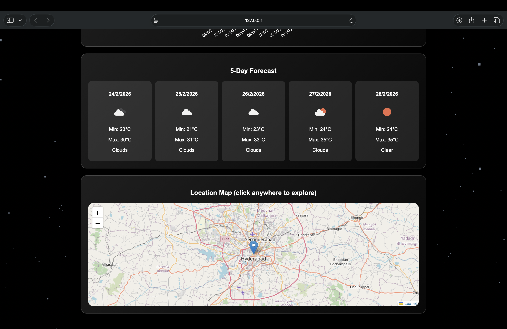

# 🌌 Omniverse Weather Engine

Omniverse Weather Engine is an advanced, glassmorphism-style weather dashboard built with HTML, CSS, and vanilla JavaScript.  
It combines live weather, 5‑day forecast, AQI & UV, interactive Leaflet maps, Chart.js analytics, AI-style guidance, favorites, city comparison, and a 3D omniverse background powered by Three.js.

> Built by Sameer Ahmed.

---

## 🔗 Live Demo

Try the app here:  
https://sameer-sde.github.io/omniverse-weather-app/

---

## ✨ Key Features

- City search with Enter key support and loading state.
- Auto-detect last city and optional geolocation (fallback to Hyderabad on first load).
- Current weather card with temperature, description, feels-like vs actual, humidity, pressure, visibility, wind, sunrise, and sunset.
- 5‑day forecast with per-day min/max and weather icon.
- Next 24 hours:
  - Hourly strip with icon, temp, conditions, rain chance, and comfort color.
  - Temperature chart (line graph) using Chart.js.
  - Wind & humidity chart with dual y-axis (wind + humidity).
- Air Quality Index (AQI) and UV Index using OpenWeather Air Pollution and One Call APIs.
- Smart alert banner for heatwaves, storms, heavy rain, and poor air quality.
- AI-style guidance:
  - Weather advice (heat/cold, rain/snow, wind, humidity, AQI).
  - Mood & clothing suggestions.
  - Allergy hints and daily min–max summary.
- Rotating tips with shortcuts and safety tips.
- Favorites system with localStorage and quick buttons (up to 5 recent cities).
- City comparison card (two cities side‑by‑side: temp, condition, humidity).
- Voice search via `webkitSpeechRecognition` (where supported).
- Unit toggle between metric (°C, m/s) and imperial (°F, mph), persisted in localStorage.
- Keyboard shortcuts: `Ctrl+K` (focus search), `Ctrl+1` (geolocation weather), `Ctrl+2` (toggle unit).
- Interactive Leaflet map with click‑to‑load weather for any point.
- 3D omniverse background using Three.js particles, adapting to weather and day/night.

---

## 🎨 UI & Experience

- Glassmorphism cards with blur, gradients, and shadows for a modern look.
- Fixed full‑screen 3D particle background canvas (`#bg`) rendered with Three.js.
- Responsive layout:
  - Forecast grid: 5 columns on desktop, 2 on tablet, 1 on small screens.
  - Details grid: 3 columns on larger screens, 2 on small screens.
- Scrollable hourly strip with hover elevation effect.
- Mobile‑friendly typography and padding via media queries.

---

## 📸 Screenshots

